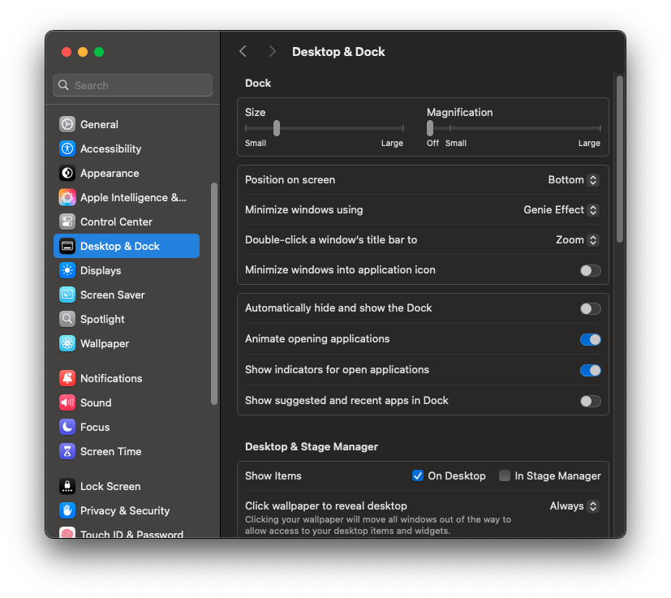
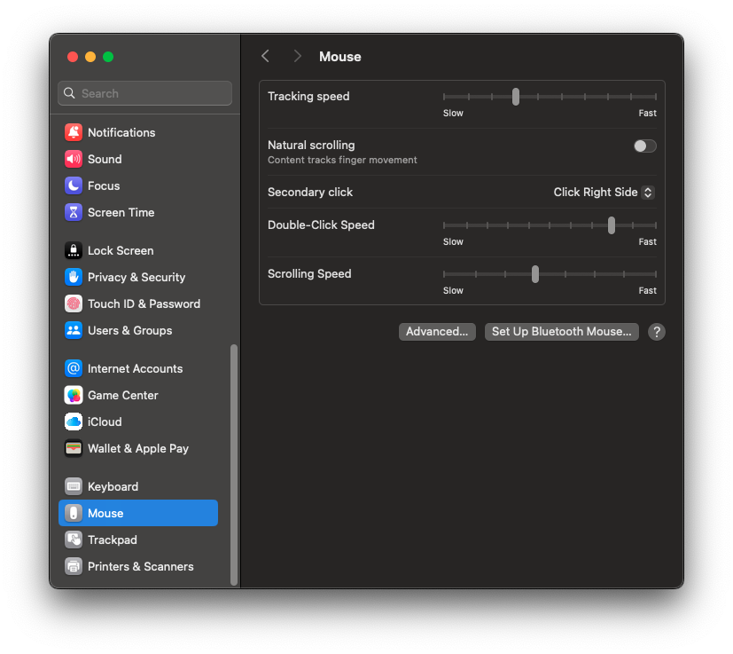
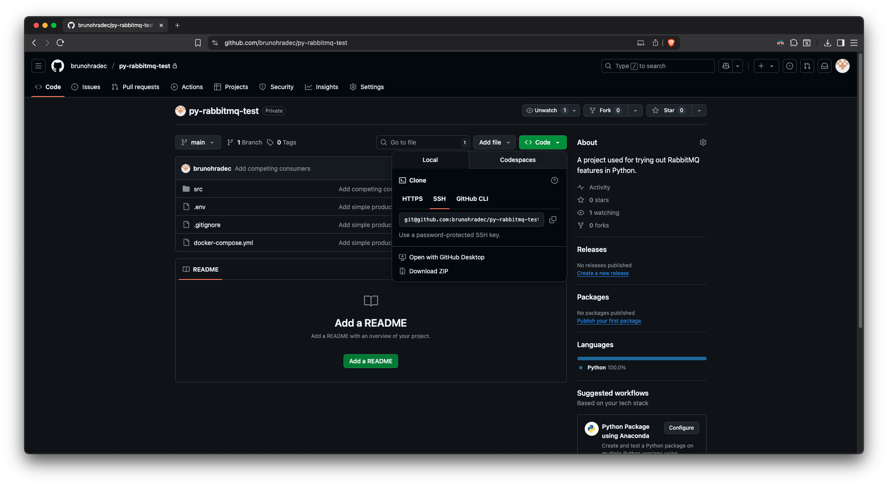

# macOS setup

This is a setup I use on all my macOS based machines I use heavily for development. I refined it over many years I use macOS, and as of today, it has worked very well.

## 1. Install dev tools

For installing all necessary development tools on macOS (required for next steps), simply open the terminal and try using `git` or any other dev tools (`gcc`, `clang`, …) from the terminal, for example:

```bash
git --version
```

This will trigger a pop-up offering to install development tools. Accept that and all the required tools will be installed.

### `git` setup

After `git` is installed, setup your name and email, otherwise it will complain on your first commit:

```bash
git config --global user.name "John Doe"
git config --global user.email johndoe@example.com
```

### Alternative approach

There is also an alternative way to achieve the same thing, and that is to trigger the dev tools installation directly, like this:

```bash
xcode-select –-install
```

## 2. Install `omz` for better shell experience

To get an improved version of `zsh` (macOS default shell) that supports plugins, displays git info by default and other cool stuff, install `omz`.

<aside>

Do this step now as `omz` creates a new `.zshrc` file, that all the following steps will use

</aside>

It’s a simple command that can be found here: [oh my zsh](https://ohmyz.sh/)

Install command:

```bash
sh -c "$(curl -fsSL https://raw.githubusercontent.com/ohmyzsh/ohmyzsh/master/tools/install.sh)"
```

## 3. Install `brew` for package management

Homebrew is the defacto standard package manager on macOS. This enables you to easily install and manage packages from the terminal, similar to what `apt` does on Debian based Linux distributions.

<aside>

Since many tools use `brew` as the default installation method, this step is highly recommended.

</aside>

It can be installed using a simple command found here: [Homebrew](https://brew.sh/)

Install command:

```bash
/bin/bash -c "$(curl -fsSL https://raw.githubusercontent.com/Homebrew/install/HEAD/install.sh)"
```

## 4. Install `nvm` for Node.js version management

<aside>

If you don’t use Node.js, you can skip this step or come to it later. 

***But please, don’t ever install Node.js manually without `nvm` as that will cause unnecessary issues.***

</aside>

If you use Node.js, you will definitely encounter situations where you have different projects using different versions, or simply you will need to update the Node.js version on your system. Additionally, many projects contain an `.nvmrc` file specifying the required Node.js version used by the project. 

For the reasons listed above, it’s highly recommended to use `nvm` on any Unix-like system.

It can be installed by using a simple command: [GitHub - nvm-sh/nvm: Node Version Manager](https://github.com/nvm-sh/nvm?tab=readme-ov-file#install--update-script)

Install command:

```bash
curl -o- https://raw.githubusercontent.com/nvm-sh/nvm/v0.40.3/install.sh | bash
```

### Use examples

Install the latests Node.js LTS:

```bash
nvm install --lts
```

List installed Node.js version:

```bash
nvm ls
```

List Node.js version available for installation:

```bash
nvm ls-remote
```

Install specific version of Node.js:

```bash
nvm install 22
```

Use specific version of Node.js in the current shell:

```bash
nvm use 22
```

If you have a project that contains an `.nvmrc` file, version of node required by the project can be installed and activated by running the following commands in the project root:

```bash
# Install version specified by the .nvmrc
nvm install

# Use the version specified by the .nvmrc
nvm use
```

## 5. Install `sdk` for Java version management

<aside>

If you don’t use Java, you can skip this step or come to it later. 

***If you use Java, this step is highly recommended as it will significantly simplify managing different JDK versions on Unix-like systems.***

</aside>

If you use Java, you will probably need different versions of the JDK for different projects. Using `sdk` is a convenient tool for installing and managing different versions of JDK on Unix-like systems.

It can be installed using a simple command: [SDKMAN! the Software Development Kit Manager](https://sdkman.io/)

Install command:

```bash
curl -s "https://get.sdkman.io" | bash
```

### Use examples

List available versions of Java for installing:

```bash
sdk list java
```

Install a specific version of Java from the list:

```bash
sdk install java 24.0.2-tem
```

Use a specific Java version in the current shell:

```bash
sdk use java 24.0.2-tem
```

## 6. Install Docker

<aside>

***Please don’t install databases and caches directly on the operating system.*** That is difficult to manage, often keeps running in the background all the time, takes ports, and is very difficult to efficiently manage multiple different versions at the same time.

</aside>

For apps like `postgres`, `mysql` or `redis`, use Docker to run them. 

Preferably, create a `docker-compose` file for each project you have, and specify the needed apps like databases inside. This will allow you to easily start/stop all databases for the project.

That way, you can:

- turn containers on or off whenever needed
- run a different version of the database for every project
- delete the whole container and create it again if data or configurations are wrong
- stop currently unused containers to not use system resources

Docker for macOS can be installed here: [Docker: Accelerated Container Application Development](https://www.docker.com/)

<aside>

Make sure you pick the Apple Silicon version if you have an M-series Mac.

</aside>

## 7. Install a better terminal emulator

Since the default macOS terminal is very limited in many ways, there are much better options available, one of them being iTerm2.

[iTerm2 - macOS Terminal Replacement](https://iterm2.com/)

## 8. Change some default settings

### Dock

By default, the dock on macOS takes a lot of space. Two things I always do are:

- Reduce the dock size to take less of screen space
- Disable suggested apps from showing in the dock

Options to change this are available in “Settings” → “Desktop & Dock”



### Natural scrolling

If you use a mouse instead of the built-in trackpad on MacBooks, scrolling can be oposite of what you are used to. This is easy to change. 

Go into “Settings” → “Mouse” and disable “Natural scrolling”.



## 9. Other useful apps

### Visual Studio Code

A free, all-purpose code editor.

[Visual Studio Code](https://code.visualstudio.com/)

### IntelliJ IDEA Community

A free Java IDE.

[IntelliJ IDEA – the IDE for Pro Java and Kotlin Development](https://www.jetbrains.com/idea/)

### VLC

Apps available by default for playing videos or audio on macOS are very limited, and don’t support a lot of formats. VLC is a much better option.

[VLC media player, the best Open Source player](https://www.videolan.org/vlc/)

### Raycast

The fastest way to navigate macOS, open URLs and past snippets. It makes using macOS so much easier and faster once you get used to it. Hard to imagine using macOS without it.

[Raycast - Your shortcut to everything](https://www.raycast.com/)

### LibreOffice

A free an open source office package.

[LibreOffice - Free and private office suite - Based on OpenOffice - Compatible with Microsoft](https://www.libreoffice.org/)

### Gimp

A free and open source advanced image editor.

[GIMP](https://www.gimp.org/)

### Ollama

For running local LLM models.

[Ollama](https://ollama.com/)

### Kdenlive

A free and open-source video editor.

[Kdenlive - Free and Open Source Video Editor](https://kdenlive.org/)

## 10. GitHub access setup

If you use GitHub, you need a way to access your private repositories. Since GitHub doesn't support username and password auth, the easiest way to set it up on Unix-like systems I have found is using SSH.

<aside>

This approach also enables you to easily use multiple GitHub accounts on the same machine, opposed to saving auth tokens where this is more difficult.

</aside>

### Generate SSH keys

```bash
ssh-keygen -t ed25519 -C "your_email@example.com"
```

Use all the default settings and don't set a passsphrase. This should generate two files in `~/.ssh` directory, one containing a private key, and one containig a public key (ending in `.pub`).

### Copy the SSH key to the buffer

Copy the public key to the buffer.

```bash
pbcopy < ~/.ssh/id_ed25519.pub
```

### Add the SSH key to GitHub

On GitHub, navigate to "Settings" -> "SSH and GPG keys". Click on "New SSH key", set an appropriate name and paste the copied key into the key textarea.

### Cloning a private repo

Private repositories can now be cloned by copying the URL available under "Code" -> "SSH" in the repository:



For example:
```bash
git clone git@github.com:brunohradec/py-rabbitmq-test.git
```

If prompted about GitHub key fingerprint, input "yes" in the terminal. 

<aside>

No additional configuration is needed, this allows you to clone and push to all your private repos.

</aside>

Repeat the same process for any other GitHub account.
